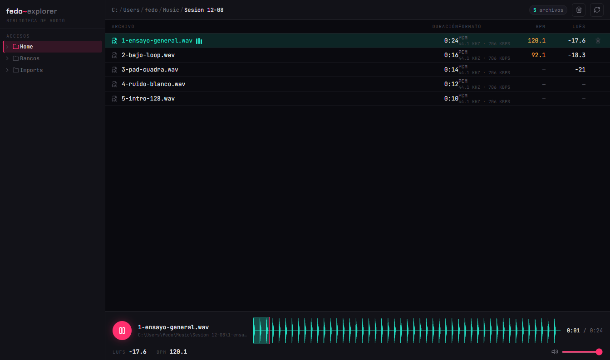

# fedo~explorer

> Explorador de archivos de audio con reproducción integrada, metadata técnica, waveform y análisis de BPM y loudness. Hecho con Electron + React + Vite.

**fedo~explorer** es un explorador de archivos de audio para escritorio que permite navegar tus carpetas, reproducir cualquier archivo compatible sin abrirlo en otro programa, y ver al instante su metadata técnica (duración, codec, bitrate, sample rate, canales), la forma de onda, el tempo detectado y el loudness integrado.

Escrito por **Federico Cruz (fedo~sound)** — una herramienta pensada para técnicos de sonido y músicos que trabajan con muchas carpetas de audio.

> La biblioteca de la captura es de audio sintético: los BPM y los LUFS que
> muestra son mediciones reales de los archivos, no valores de ejemplo.



## Descargas

**Windows x64 primero** — El instalador es para Windows x64, sin dependencias externas de Python ni ffmpeg: el audio lo decodifica el navegador (Electron/Chromium).

Instalador para Windows (x64), sin instaladores de Python ni ffmpeg: el audio lo decodifica el navegador.

| Versión | Archivo | Tamaño |
|---------|---------|--------|
| [0.2.1](https://github.com/fedecruz1981/fedo-explorer/releases/tag/v0.2.1) | `fedo.explorer.Setup.0.2.1.exe` | 110,7 MB |
| [0.2.0](https://github.com/fedecruz1981/fedo-explorer/releases/tag/v0.2.0) | `fedo.explorer.Setup.0.2.0.exe` | 110,7 MB |

[Todas las releases](https://github.com/fedecruz1981/fedo-explorer/releases) · [reportar un problema](https://github.com/fedecruz1981/fedo-explorer/issues)

## Características

- 📂 **Explorador de carpetas**: sidebar con accesos rápidos (Home, Escritorio, Documentos, Descargas, Música) y todos los discos disponibles
- 🔊 **Reproducción integrada**: streaming por un protocolo propio (`fedo-media://`) con soporte **HTTP Range** (seek real en archivos largos)
- 🎚️ **Transporte completo**: play/pausa, seek sobre el waveform, volumen, atajos de teclado (Espacio, Supr)
- 📊 **Metadata técnica** vía `music-metadata`: duración, contenedor, codec, bitrate, sample rate y canales
- ⏱️ **Detección de BPM**: autocorrelación del flujo de onsets en tres bandas, con prior log-gaussiano sobre 120 BPM
- 🔊 **Loudness integrado (LUFS)**: implementación propia de **EBU R128 / ITU-R BS.1770-4** (curva K con los dos gates), sin depender de ffmpeg
- 🌊 **Waveform** calculado en segundo plano y cacheado por archivo, junto con el BPM y el LUFS del mismo buffer decodificado
- 🗑️ **Borrado a papelera** del sistema (no destruye archivos)
- ⚡ Conteo de audio **recursivo** por carpeta, con corte de seguridad a 20.000 archivos
- 🔒 Seguridad: `contextIsolation` + `nodeIntegration: false`, API expuesta vía bridge tipado

## Formatos soportados

`mp3` `wav` `flac` `ogg` `oga` `m4a` `aac` `aiff` `aif` `wma` `opus` `webm` `mka` `mpc` `ape` `amr` `caf`

## Detalles del análisis de audio

- Los bytes del archivo llegan al renderer por IPC y se decodifican **una sola vez** con Web Audio API: de ese mismo buffer salen el waveform, el BPM y el LUFS.
  No se usa `fetch` contra `fedo-media://` porque, con el renderer cargado desde `file://` (la app instalada), el navegador bloquea por CORS cualquier fetch a un esquema propio.
- El **BPM** usa el rectified spectral flux en bandas graves/medios/agudos a 11 kHz, autocorrelación en el rango 60-200 BPM y plegado de octavas al rango 60-180.
  Un archivo sin contenido percusivo (un tono continuo, por ejemplo) informa «—» en vez de un tempo inventado.
- El **LUFS** usa bloques de 400 ms con salto de 100 ms, gate absoluto de -70 LUFS y gate relativo de -10 LU, con los pesos de canal de BS.1770-4
  (dos canales idénticos miden 3 dB más que mono, por dual mono real).
- Todo el análisis se valida con señales sintéticas: tracks de clicks a BPM conocidos y senos de frecuencia y amplitud conocidas.

## Roadmap

- 🖼️ Captura de pantalla y demo instalable
- 🏷️ Etiquetas y búsqueda dentro de la carpeta (ID3 / Vorbis comments)

## Cómo ejecutarlo

Requiere **Node 24** (Vite 8 pide 20.19+ y Vitest 5 pide 22.12+, asi que 20 se queda corto).

```bash
npm install       # instala dependencias
npm run dev       # desarrollo (Vite + Electron con hot reload)
npm run build     # compila el renderer a ./dist
npm run start     # compila y abre la app
```

Para generar instaladores:

```bash
npm run pack      # build de la carpeta de la app
npm run dist      # instalador (NSIS / dmg / AppImage)
```

## Estructura

```text
/
├── electron/
│   ├── main.js           # proceso principal: IPC, protocolo de streaming, filesystem
│   └── preload.js        # puente seguro window.fedo
├── src/
│   ├── App.jsx           # orquestación: árbol, tabla, transporte, borrado
│   ├── components/       # Sidebar, FileTable, TransportBar, Waveform
│   ├── lib/              # peaks (decodificación), dsp, loudness, tempo, analysis, format
│   └── styles.css
├── vite.config.js
└── package.json
```

## Stack

`Electron` · `React` · `Vite` · `music-metadata` · `lucide-react` · JSX moderno

## Licencia

[MIT](./LICENSE)